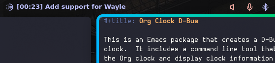
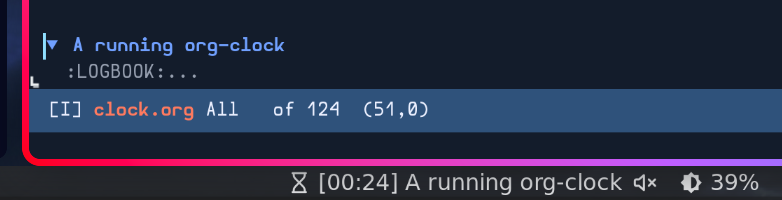

#+title: Org Clock D-Bus

This is an Emacs package that creates a D-Bus API for the OrgMode
clock.  It includes a command line tool that can be used to control
the Org clock and display clock information in your desktop's panel.

* Using the Emacs Package

  1. Put the =org-clock-dbus.el= file in your load path

  2. Load the file

  3. Start the minor mode:

     #+header: :exports code
     #+begin_src emacs-lisp
       (org-clock-dbus-mode)
     #+end_src

* Using the =org-clock-dbus= Tool

  The =org-clock-dbus= tool allows you to view and control the OrgMode
  clock from the command line.  It can be built from source or you can
  download a pre-built binary from the GitHub release.

** Stopping the Running Clock

   #+header: :exports code
   #+begin_src sh
     org-clock-dbus stop
   #+end_src

** Wayle Configuration

   

   The following configuration will display the Org heading for the
   current clock, and a countdown from 25 minutes:

   #+header: :exports code
   #+begin_src toml
     [[bar.layout]]
     # Normal bar stuff...
     center = [{class = "org-clock-dbus", module = "custom-org-clock-dbus"}]

     [[modules.custom]]
     id = "org-clock-dbus"
     command = "org-clock-dbus monitor --mode wayle --down-from 25m"
     mode = "watch"
     format = "{{ text }}"
     class-format = "{{ sign }}"
     hide-if-empty = true
     icon-name = "tb-time-duration-30-symbolic"
     left-click = "org-clock-dbus stop"
   #+end_src

   If you want to clock module to stand out when the timer goes
   negative use the following CSS:

   #+header: :exports code
   #+begin_src css
     .org-clock-dbus.negative menubutton.bar-button {
       --bar-btn-label-color: var(--bg-surface);
       --bar-btn-bg: var(--status-error);

       image {
         --bar-btn-icon-color: var(--bg-surface);
       }
     }
   #+end_src

** Waybar Configuration

   

   The following configuration will display the Org heading for the
   current clock, and a countdown from 25 minutes:

   #+header: :exports code
   #+begin_src json
     "custom/org-clock-dbus": {
       "exec": "org-clock-dbus monitor --mode waybar --down-from 25m",
       "on-click": "org-clock-dbus stop",
       "format": "{icon} {text}",
       "format-icons": {
         "running": "",
         "negative": ""
       },
       "max-length": 100,
       "return-type": "json"
     }
   #+end_src

   The following classes are available:

   - =stopped= :: The clock is not running.

   - =running= :: The clock is running.

   - =negative= :: The clock is running in countdown mode and the time
     has gone below zero.

* Using the D-Bus API

** Getting the Current Clock State

   #+header: :exports code
   #+begin_src sh
     dbus-send \
       --session \
       --print-reply \
       --dest="org.gnu.Emacs.Org.Clock" \
       /org/gnu/Emacs/Org/Clock \
       "org.freedesktop.DBus.Properties.Get" \
       string:"org.gnu.Emacs.Org.Clock" \
       string:"state"
   #+end_src

** Monitoring the Clock State

   #+header: :exports code
   #+begin_src sh
     dbus-monitor \
       "$(
         cat <<EOT | tr -d ' \n'
           type=signal,
           interface=org.freedesktop.DBus.Properties,
           member=PropertiesChanged,
           path=/org/gnu/Emacs/Org/Clock
     EOT
       )"
   #+end_src

** Stopping the Running Clock

   #+header: :exports code
   #+begin_src sh
     dbus-send \
       --session \
       --print-reply \
       --dest="org.gnu.Emacs.Org.Clock" \
       /org/gnu/Emacs/Org/Clock \
       "org.gnu.Emacs.Org.Clock.Stop"
   #+end_src
